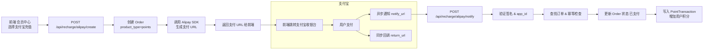

# 支付宝充值模块设计文档

创建日期：2026-01-16  
适用项目：AIOffer 会员管理系统  
状态：设计阶段（仅方案，不含实现）

---

## 1. 设计目标与范围

- 支持会员通过支付宝完成人民币充值，系统将充值金额按规则转换为积分（points），写入现有积分体系。
- 对接现有订单（Order）与点数交易（PointTransaction）模型，实现**订单驱动的支付流程**。
- 使用 `tmp/real_alipay.py` 中已验证的支付宝接入逻辑作为“支付网关原型”，将其改造为后端服务的一部分，而不是独立 Flask 应用。
- 不改动现有“余额支付”逻辑（`/api/orders/{order_id}/pay` 里当前只支持从 member.balance 扣款），支付宝充值是“人民币 → 积分”的新增通道。
- 新增套餐化（Package）充值能力，支持按不同金额档位和周期套餐进行售卖。

不在本次范围：

- 不实现退款、关单等高级能力（预留扩展点）。
- 不实现支付宝小程序、当面付等其他支付产品形态。
- 不实现多商户 / 多应用 APPID 隔离（默认单应用）。

---
### 1.1 充值套餐

本次设计中，系统引入“套餐化充值”概念，分为两类：

- **积分类套餐（Points Package）**：一次性充值一定金额，获得对应的积分，可用于系统内消费。
- **时长类套餐（Time Package）**：按天 / 月 / 季度 / 年购买使用权，主要用于后续可能的“订阅制服务”（本设计先做规则约定，不立即实现具体业务逻辑）。

当前规划的套餐示例如下（仅作为产品配置参考，最终以上线时的数据库配置为准）：

- 注册赠送：会员注册成功后，系统自动赠送 3 点（不走支付宝，仅作为系统内置赠送策略）。
- 积分充值套餐：
  - 5 元 → 10 点（小额体验包）。
- 时长套餐（预留业务能力）：
  - 15 日套餐：15 元。
  - 月度套餐：25 元。
  - 季度套餐：50 元。
  - 半年套餐：80 元。
  - 年度套餐：120 元。

约束与说明：

- 上述套餐最终都应建模为产品（Product）配置项，其中：
  - 积分类套餐：`type = "points"`，包含 `price` 与 `points` 字段。
  - 时长类套餐：`type = "subscription"` 或类似标识，包含 `price` 与 `duration`（例如天数或按周期编码）。
- 本设计的支付宝充值实现，**优先落地积分类套餐**；  
  时长类套餐在本设计中仅做需求与模型预留，具体“权限开通/到期处理”可在后续订阅模块中实现。

## 2. 整体架构设计

### 2.1 模块分层

- **表现层（API 层）**
  - `POST /api/recharge/alipay/create`：创建支付宝充值订单，返回前端所需的支付 URL / 参数。
  - `GET  /api/recharge/alipay/return`：同步回调（浏览器跳转），用于展示支付结果页面。
  - `POST /api/recharge/alipay/notify`：异步通知（服务器回调），用于最终落账与幂等更新。

- **业务层（Service 层，计划新增）**
  - `AlipayRechargeService`：封装订单创建、签名校验、通知处理、积分入账等复杂逻辑。

- **基础设施层**
  - **支付宝 SDK 封装**：参考 `tmp/real_alipay.py`，抽象为 `utils/alipay_client.py`（计划）。
  - **配置管理**：通过 `.env` / settings 读取支付宝 `APPID`、私钥、公钥、网关地址、域名等。

### 2.2 与现有模型的关系

- `Order` 表：
  - 用于记录每次充值的业务订单。
  - `product_type` 固定为 `"points"`。
  - `payment_method` 为 `"alipay"`。
  - 支付成功后 `status` 设置为 `2`（已支付），`payment_time` 写入通知时间。
- `PointTransaction` 表：
  - 每次支付宝充值成功后写入一条 `type = 1`（充值）的点数交易记录。
  - `related_id` 指向 `Order.id`，`related_type = "alipay"` 或 `"order" + "alipay"`。

### 2.3 高层架构图（Mermaid）

---

## 3. 业务流程设计

### 3.1 创建充值订单（前端 → 后端）

入口场景：

- 会员在“我的账户 / 点数充值”页面选择一个充值套餐。  
  - 对于**积分类套餐**：例如“5 元 → 10 点”“50 元 → 500 点”等。
  - 对于**时长类套餐**：例如“15 日套餐 15 元”“年度套餐 120 元”等（本阶段仅作产品配置展示，具体订阅权限由后续模块接管）。

调用流程：

1. 前端调用 `GET /api/orders/products/list` 拿到可选产品（已有接口）。
2. 用户选择一个 `type=points` 的产品，前端提交：

   - `POST /api/recharge/alipay/create`
   - 请求体：
     - `product_id`：点数套餐 ID（与 `get_products` 的 `id` 对应）。
     - `amount`：金额（元），冗余校验用。
     - `client_type`：`"pc"` / `"h5"`，决定使用 page 支付还是 H5 支付。

3. 后端逻辑：

   - 校验产品是否存在、金额是否匹配（防止前端篡改）。
   - 根据产品类型分支处理：
     - 当产品为**积分类套餐**（`type = "points"`）时：
       - 新建一条 `orders` 记录：
         - `product_type = "points"`
         - `amount = 产品价格`
         - `status = 1`（待支付）
         - `description` 包含“支付宝充值点数”等可读信息。
     - 当产品为**时长类套餐**（`type = "subscription"` 等）时：
       - 新建一条 `orders` 记录：
         - `product_type = "subscription"`
         - `amount = 产品价格`
         - `status = 1`（待支付）
         - `description` 中标明套餐周期信息（如“年度套餐”）。
       - 本设计阶段**不直接开通具体订阅权限**，仅完成支付与订单闭环，后续订阅模块可通过 `Order` 记录与套餐配置实现权限开通与到期处理。
   - 生成支付宝 `out_trade_no`：
     - 与 `Order.order_no` 一一对应，可以复用 `generate_order_no`，也可以另加前缀（如 `"ALI_"`）。
   - 通过支付宝 SDK 生成支付链接：
     - PC：`AlipayTradePagePayRequest` + `AlipayTradePagePayModel`
     - H5：`AlipayTradeWapPayRequest` + `AlipayTradeWapPayModel`
   - 返回前端：
     - `order_id`
     - `order_no`
     - `pay_url`（H5/PC 通用支付 URL）
     - （可选）`alipay_scheme`（便于 App 内唤起）

4. 前端拿到 `pay_url` 后，直接 `window.location.href = pay_url` 或在新窗口打开。

### 3.2 支付宝同步回调（浏览器跳转）

- 支付成功后，支付宝会带着参数跳转到 `return_url`。
- 该回调用于：
  - 给用户展示“支付成功/失败”页面。
  - 不作为最终记账依据（真正记账依赖异步 `notify`）。

设计：

- 路由：`GET /api/recharge/alipay/return`
- 参数：支付宝标准同步回调参数（`out_trade_no`、`total_amount`、`trade_status` 等）。
- 逻辑：
  1. 验签（RSA2，使用公钥）。
  2. 校验 `app_id` 是否匹配配置。
  3. 查找订单（通过 `out_trade_no` 或 `order_no`）。
  4. 不直接修改数据库，只查询订单当前状态并渲染一个简单的 HTML 页面（或 JSON，视前端集成方式而定）。

### 3.3 支付宝异步通知（服务器回调）

这是核心的“确认支付成功并发积分”的入口。

- 路由：`POST /api/recharge/alipay/notify`
- 参数：支付宝标准异步通知参数（`out_trade_no`、`total_amount`、`trade_status` 等）。

处理流程：

1. 记录原始报文（可写日志）。
2. 验签：
   - 使用公钥，对 `sign` 进行 RSA2 验证。
   - 对应逻辑已在 `real_alipay.py` 的 `verify_alipay_sign` 中实现，可抽取复用。
3. 校验关键字段：
   - `app_id` 是否匹配。
   - `total_amount` 是否与本地订单金额一致。
   - `seller_id` / `seller_email` 如需要也可校验。
4. 幂等处理：
   - 根据 `out_trade_no` 查找订单。
   - 如果订单已是 `status=2`（已支付），直接返回 `success`，不重复发积分。
5. 状态更新与积分入账：
   - 将订单状态设置为 `2`，`payment_method="alipay"`，`payment_time=通知时间`。
   - 根据业务规则计算积分（可直接用产品中的 `points` 字段，而不是动态 `amount * rate`）：
     - 更新 `member.points`。
     - 写入 `PointTransaction`：
       - `type = 1`（充值）
       - `points = 本次增加的积分`
       - `balance_after = 当前 member.points`
       - `amount = 订单金额`
       - `description = f"支付宝充值：{order.order_no}"`
       - `related_id = order.id`
       - `related_type = "alipay"`
6. 全部成功后返回字符串 `"success"`，否则返回 `"failure"`。

---

## 4. 配置与安全设计

### 4.1 配置项

在 `backend/.env`（通过 `settings` 读取）新增支付宝相关配置：

- `ALIPAY_APP_ID`
- `ALIPAY_PRIVATE_KEY_PATH`
- `ALIPAY_ALIPAY_PUBLIC_KEY_PATH`
- `ALIPAY_GATEWAY=https://openapi.alipay.com/gateway.do`
- `ALIPAY_NOTIFY_URL=https://your-domain/api/recharge/alipay/notify`
- `ALIPAY_RETURN_URL=https://your-domain/api/recharge/alipay/return`

密钥管理：

- 私钥、公钥放在后端服务器的安全目录（例如 `backend/keys/`），不入库、不提交 Git。
- `.gitignore` 确保 `keys/` 目录不会被提交。

### 4.2 安全与幂等

- **签名验证**：
  - 所有同步/异步回调必须通过 RSA2 验签。
  - 验签失败一律视为非法请求。
- **幂等处理**：
  - 通过订单状态控制重复通知：
    - 如果订单已是 `status=2`，再次收到 `TRADE_SUCCESS` 直接返回 `"success"`。
- **金额与商户信息校验**：
  - `total_amount` 与本地订单必须一致。
  - `app_id` 必须等于配置的 `ALIPAY_APP_ID`。
  - 如有需要校验 `seller_id`，也在 `.env` 中声明并校验。

---

## 5. 数据模型与接口契约

### 5.1 新增 / 调整的后端接口

1. **创建支付宝充值订单**

   - `POST /api/recharge/alipay/create`
   - 请求体（JSON）：
     - `product_id: int`  （必须）
     - `client_type: "pc" | "h5"`（可选，默认 `"h5"`）
   - 响应（成功）：
     - `order_id: int`
     - `order_no: string`
     - `pay_url: string`
     - `alipay_scheme?: string`

2. **支付宝同步回调**

   - `GET /api/recharge/alipay/return`
   - 请求参数：支付宝同步回调原始参数。
   - 响应：
     - 简单 HTML 页面（支付成功/失败），或重定向到前端某个结果页。

3. **支付宝异步通知**

   - `POST /api/recharge/alipay/notify`
   - 请求参数：支付宝异步通知表单。
   - 响应：
     - 字符串 `"success"` 或 `"failure"`。

### 5.2 与现有接口的对齐

- 保留现有 `POST /api/orders` 与 `POST /api/orders/{order_id}/pay`：
  - 现在的 `pay_order` 实现是“余额支付”，后续可以考虑拆成：
    - `pay_order_with_balance`
    - `pay_order_with_alipay`（由通知驱动，不对外暴露）。
- 新的充值流程不直接调用 `/api/orders/{id}/pay`，而是通过支付宝回调驱动订单状态变更。

---

## 6. 前端交互设计（简要）

### 6.1 入口位置

- 会员登录后，“我的账户”页面下新增“点数充值”区域。
- 展示现有点数余额 + 充值套餐列表。

### 6.2 操作流程

1. 页面加载时：
   - 调用 `GET /api/orders/products/list`：
     - 默认展示**积分类套餐**（`type="points"`）作为主要充值入口。
     - 如需要展示时长类套餐，可在前端通过标签或分组将其放在“订阅套餐”区域，避免与积分充值混淆。
2. 用户选择某个充值套餐，点击“支付宝支付”按钮。
3. 前端发送 `POST /api/recharge/alipay/create`：
   - 成功后拿到 `pay_url`，浏览器跳转。
4. 支付完成后：
   - 浏览器跳回 `return_url`（后端返回一个结果页面，或重定向到前端 `/recharge/result`），前端可以再调用用户信息接口刷新当前积分或订阅状态（当前阶段订阅状态仅作为展示预留）。

---

## 7. 典型业务流程示例

这一节用几个具体“用户故事”把上面的流程串起来，方便你在产品/实现时对照。

### 7.1 场景一：会员 H5 支付 50 元充值 500 积分

> 前提：  
> - 配置了一个产品：`id=3, type="points", price=50.00, points=500`  
> - 用户当前积分为 100，未登录则不能进入“我的账户”。

1. 用户打开手机浏览器，访问前端系统并登录。
2. 进入“我的账户”页面，看到：
   - 当前积分：100
   - 充值套餐列表，其中包含“点数充值包 50 元 → 500 点”。
3. 用户选择“点数充值包”并点击“支付宝支付”按钮：
   - 前端调用 `POST /api/recharge/alipay/create`，请求体大致为：
     - `product_id = 3`
     - `client_type = "h5"`
4. 后端处理：
   - 从产品列表中找到 `id=3` 的产品，确认：
     - `type == "points"`
     - 价格为 50.00 元。
   - 在 `orders` 表插入一条新订单，例如：
     - `id = 101`
     - `order_no = "ALI_20260116120000123"`
     - `user_id = 当前用户 ID`
     - `product_type = "points"`
     - `amount = 50.00`
     - `status = 1`（待支付）
   - 利用支付宝 SDK 生成 H5 支付链接，得到一个 `pay_url`。
   - 返回响应：
     - `order_id = 101`
     - `order_no = "ALI_20260116120000123"`
     - `pay_url = "https://openapi.alipay.com/gateway.do?..."`
5. 前端拿到 `pay_url` 后，直接跳转支付宝收银台：
   - 用户在支付宝中确认支付 50 元。
6. 支付完成后，支付宝做两件事：
   - 浏览器跳转到 `ALIPAY_RETURN_URL`（同步回调），用户看到“支付成功”页面。
   - 服务端回调 `ALIPAY_NOTIFY_URL`（异步通知），请求体中包含：
     - `out_trade_no = "ALI_20260116120000123"`
     - `total_amount = "50.00"`
     - `trade_status = "TRADE_SUCCESS"`
7. 后端在 `/api/recharge/alipay/notify` 中处理：
   - 验签通过，`app_id` 正确。
   - 根据 `out_trade_no` 查到订单 `id=101`。
   - 确认订单当前 `status = 1`（待支付），且金额一致。
   - 更新订单：
     - `status = 2`（已支付）
     - `payment_method = "alipay"`
     - `payment_time = 当前时间`
   - 给用户增加积分：
     - 根据产品配置 `points = 500`，将用户积分从 100 加到 600。
   - 在 `point_transactions` 中插入一条记录：
     - `user_id = 当前用户 ID`
     - `type = 1`（充值）
     - `points = 500`
     - `balance_after = 600`
     - `amount = 50.00`
     - `description = "支付宝充值：ALI_20260116120000123"`
     - `related_id = 101`
     - `related_type = "alipay"`
   - 返回 `"success"` 给支付宝。
8. 用户回到“我的账户”页面时，前端再次调用用户信息接口：
   - 展示最新积分：600
   - 你也可以在“积分明细”里看到刚刚的充值记录。

### 7.2 场景二：重复通知与幂等处理

> 前提：场景一中的订单 `ALI_20260116120000123` 已经处理成功，数据库中订单状态为已支付，积分已从 100 增加到 600。

1. 由于网络重试，支付宝又发来一次异步通知，参数基本相同：
   - `out_trade_no = "ALI_20260116120000123"`
   - `total_amount = "50.00"`
   - `trade_status = "TRADE_SUCCESS"`
2. 后端在 `/api/recharge/alipay/notify` 中再次处理：
   - 依然先验签、校验 `app_id` 和金额。
   - 根据 `out_trade_no` 查到订单：
     - 此时订单 `status = 2`（已支付）。
3. 幂等逻辑生效：
   - 发现订单已经是“已支付”状态，则不再重复：
     - 更新订单
     - 增加积分
     - 写入新的 `PointTransaction`
   - 直接返回 `"success"`。
4. 结果：
   - 用户积分仍然是 600，不会因为多次通知而被多次加积分。

### 7.3 场景三：金额不一致（安全拦截）

> 前提：系统中订单 `ALI_20260116120000999` 的金额是 50.00 元。

1. 异步通知中携带的金额被篡改或异常：
   - `out_trade_no = "ALI_20260116120000999"`
   - `total_amount = "5000.00"`（与本地订单不一致）
2. `/api/recharge/alipay/notify` 中的校验逻辑：
   - 验签通过后，查找订单。
   - 对比 `total_amount` 与本地 `order.amount`：
     - 发现不一致则认为存在风险。
3. 处理策略：
   - 不更新订单状态、不发积分、不写交易记录。
   - 记录一条告警日志，便于后续排查。
   - 返回 `"failure"` 给支付宝。
4. 效果：
   - 即使回调被攻击或配置错误，也不会给错误的订单发积分。

---

## 7. 与 real_alipay.py 的关系与重构计划

`tmp/real_alipay.py` 已经实现了完整的支付宝接入流程，包括：

- 客户端配置（APPID、私钥、公钥、网关）。
- PC 支付（`/pay`）。
- H5 支付（`/h5_pay` + H5 模板）。
- 同步回调（`/return`、`/h5_return`）。
- 异步通知（`/notify`），含验签逻辑。

重构计划：

- 抽取 SDK 初始化为 `utils/alipay_client.py`：
  - `get_alipay_client()`：从 settings 加载配置并返回 `DefaultAlipayClient`。
- 抽取验签逻辑为 `utils/alipay_sign.py`：
  - `verify_alipay_sign(params: dict) -> bool`。
- 将 Flask 路由迁移为 FastAPI 路由：
  - 使用 `APIRouter`，路径调整为 `/api/recharge/alipay/*`。
  - H5 模板可以改为 FastAPI 的 `HTMLResponse` 或简单重定向，由前端渲染结果页面。

---

## 8. 验收标准

1. 功能正确性
   - 会员可在前端选择**积分类充值套餐**，通过支付宝完成支付。
   - 支付成功后，订单状态从“待支付”更新为“已支付”，`payment_method="alipay"`。
   - 对应用户积分增加，`PointTransaction` 记录正确写入，积分值与所选套餐配置一致。
   - 注册赠送 3 点在不依赖支付宝的情况下正确发放，不与充值流程混淆。

2. 安全性
   - 所有回调均通过 RSA2 验签与 `app_id` 校验。
   - 金额、订单号匹配本地记录。
   - 异步通知具备幂等处理能力。

3. 集成完整性
   - 与现有订单列表、积分明细页面兼容，无额外字段导致的异常。
   - 前后端 `.env` 中支付宝相关配置说明清晰，不会误提交密钥到 Git。

4. 可扩展性
   - 前端与后端对“时长类套餐”的字段/类型约定清晰，后续接入订阅模块时无需调整支付宝对接层。
   - 后续可基于该设计扩展退款、会员套餐购买等支付宝能力，而无需重写核心支付集成代码。
