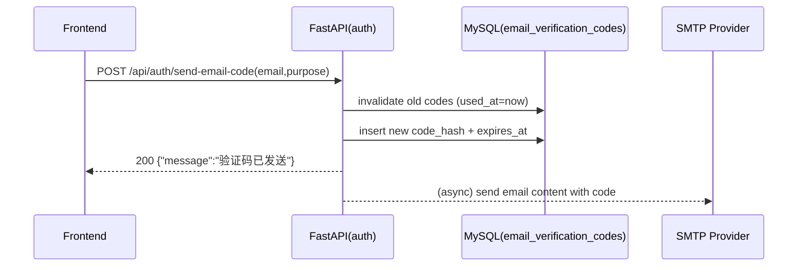

# 邮件验证码模块设计方案

> 目标：基于现有代码与 [tmp/mail.py](file:///root/aioffer/tmp/mail.py) 的思路，完善“邮件验证码（Email Verification Code）”模块的可落地设计；本阶段只输出设计，不做开发与改动。

## 1. 背景与现状

### 1.1 tmp/mail.py 的能力与风险点

[tmp/mail.py](file:///root/aioffer/tmp/mail.py) 展示了一个可工作的 SMTP 发信样例（以阿里云邮件推送为例），包含：

- 验证码生成：纯数字 `code_length` 位随机数
- 邮件构建：`MIMEMultipart('alternative')` + HTML 正文
- SMTP 发送：`smtpdm.aliyun.com`，端口 80（示例），`SMTP.login` + `sendmail`

主要问题（需要在系统设计中规避）：

- 明文账号/密码硬编码（必须迁移到 `.env` / 配置体系）
- 控制台打印验证码（线上必须禁止）
- 缺少用途（purpose）、频控（rate limit）、重放/刷码防护、审计信息结构化记录
- 单脚本无法与现有 FastAPI/DB 流程集成

### 1.2 现有后端已具备的基础

后端当前已有“发送邮箱验证码 + 注册校验”的雏形，集中在：

- 路由：[auth.py](file:///root/aioffer/backend/routers/auth.py)
  - `POST /api/auth/send-email-code`：生成验证码、入库 `EmailVerificationCode`、后台任务发送邮件
  - `POST /api/auth/register`：读取最新未使用验证码、校验过期与哈希匹配、使用标记 `used_at`
- 数据模型：[user.py](file:///root/aioffer/backend/models/user.py)
  - `EmailVerificationCode(email, purpose, code_hash, expires_at, used_at, ip, user_agent, created_at)`
- 配置：[settings.py](file:///root/aioffer/backend/config/settings.py)
  - `smtp_host/smtp_port/smtp_user/smtp_password/smtp_use_tls/smtp_use_ssl`
  - `email_from/email_from_name/email_code_expire_minutes`

当前缺口（设计层面需要补齐）：

- 邮件内容模板（纯文本 vs HTML、品牌信息、可配置主题）
- 频控策略与滥用防护（按邮箱/IP/UA 的限流与冻结策略）
- 目的（purpose）扩展：不仅是 register，还可能用于 reset_password / change_email 等
- 可靠性：BackgroundTasks 的成功/失败不可观测，且失败无法自动重试
- 数据一致性：发送成功与否与数据库记录的关系、是否需要发送状态字段
- 可审计与可观测：日志字段规范、敏感信息脱敏

## 2. 设计目标与非目标

### 2.1 设计目标（可测试）

- 统一邮件验证码生命周期：生成 → 存储（仅 hash）→ 发送 → 校验 → 标记已用/失效
- 安全：验证码不落日志、不落库明文；校验使用常量时间比较（constant-time compare）
- 防滥用：支持按邮箱/IP 的频率限制（resend 间隔、每日上限、失败次数上限）
- 可观测：发送与校验的结构化日志与指标（成功/失败原因、耗时、provider）
- 可扩展：在不破坏现有接口的前提下，逐步支持更多 purpose 与更可靠的发送机制

### 2.2 非目标（本期不做）

- 不引入新邮件服务商 SDK（保持 SMTP 通用实现）
- 不改造前端交互与 UI
- 不引入完整分布式限流系统（如 API Gateway 级限流）
- 不实现生产级异步任务系统（可在扩展方案中设计，但本期不落地）

## 3. 业务与数据模型

### 3.1 业务概念

- Email Code（邮箱验证码）
  - `purpose`：验证码用途（建议枚举化）
  - `expires_at`：过期时间
  - `used_at`：已使用时间（用于一次性使用）
  - `code_hash`：验证码哈希（基于 secret 的 HMAC，不可逆）

### 3.2 purpose 规范（建议）

| purpose | 说明 | 是否要求“邮箱不存在” | 是否要求“邮箱已存在” |
|---|---|---:|---:|
| register | 邮箱注册 | 是 | 否 |
| reset_password | 找回密码 | 否 | 是 |
| change_email | 变更邮箱 | 取决于业务规则 | 取决于业务规则 |

备注：当前实现固定 `register`，设计上建议把 purpose 提升为请求参数（兼容默认 register）。

### 3.3 数据表（沿用现有 EmailVerificationCode）

核心字段与语义（沿用现有模型）：

- `email`：收件邮箱（建议存小写规范化）
- `purpose`：用途字符串（建议枚举）
- `code_hash`：`HMAC(secret_key, f"{email}:{code}")`
- `expires_at`：过期时间（建议 `now + expire_minutes`）
- `used_at`：使用时间（一次性消费）
- `ip/user_agent`：审计与风控字段
- `created_at`：创建时间

建议索引（设计建议，暂不落地）：

- `(email, purpose, used_at)` 组合索引：快速查找“最近一个未使用验证码”
- `(email, purpose, created_at)`：用于频控统计
- `(ip, created_at)`：用于 IP 维度风控统计

## 4. 接口契约（API Contract）

> 现有实现路径：`/api/auth/send-email-code` 和 `/api/auth/register`。本设计在兼容基础上扩展。

### 4.1 发送验证码

**Endpoint**
- `POST /api/auth/send-email-code`

**Request**
- `email: EmailStr`
- `purpose?: str`（新增，默认 `register`）

**Response（保持现有 success/error 结构）**
- 成功：`{"code": 200, "message": "验证码已发送", "data": null}`
- 失败：`{"code": <业务码>, "message": <原因>, "data": null}`

**业务规则**
- 校验 SMTP 配置存在，否则直接拒绝
- 与 purpose 关联的邮箱存在性校验（register 要求不存在、reset_password 要求存在等）
- 发送前失效旧码：同 `(email, purpose)` 的旧未使用验证码统一置 `used_at=now`（现有实现已做）
- 生成新码：6 位数字（建议固定长度，避免前端/用户困惑）
- 入库：只存 `code_hash`，不存明文 code

### 4.2 校验验证码（注册流程内联）

当前注册接口 `POST /api/auth/register` 已包含校验逻辑（`email_code`），建议保留。

可选扩展（设计建议，暂不落地）：
- `POST /api/auth/verify-email-code`：只校验，不注册，用于前端分步校验场景。

**校验规则**
- 只取最近一条未使用验证码（按 `id desc limit 1`）
- `expires_at > now` 且 `used_at is null`
- `hmac.compare_digest(code_hash, hash_email_code(email, input_code))`
- 校验成功后：写 `used_at=now`（一次性）

## 5. 发送实现设计（SMTP + 模板）

### 5.1 SMTP 参数与环境变量

沿用 [settings.py](file:///root/aioffer/backend/config/settings.py) 的配置项，建议明确以下约束：

- `smtp_use_ssl=true` 时使用 SMTPS（常见 465）
- `smtp_use_tls=true` 时使用 STARTTLS（常见 587）
- 端口 80（如 tmp/mail.py）只在特定厂商/网关场景成立，设计上应允许配置，但不写死

敏感信息约束：
- `smtp_password` 只允许来自 `.env` 或运行环境变量，禁止写入仓库

### 5.2 邮件内容模板

模板目标：
- 支持纯文本（text/plain）与 HTML（text/html）双格式
- 可配置品牌名（Product Name）、签名、有效期分钟数

建议模板变量：
- `code`：验证码（仅用于渲染，不记录日志）
- `expire_minutes`：有效期
- `purpose_text`：用途中文文案（注册/找回等）
- `product_name`：产品/系统名称
- `support_contact`：可选客服信息

主题与标题规范（建议）：
- subject：`【{product_name}】{purpose_text}验证码：{code}`

## 6. 风控与限流设计（重点）

### 6.1 限流维度

建议至少实现 3 层策略（设计要求，可分阶段落地）：

1) **单邮箱 resend 间隔**：例如 60 秒内只能发送一次  
2) **单邮箱每日上限**：例如 10 次/日  
3) **单 IP 每日上限**：例如 50 次/日（防止批量撞库）  

### 6.2 数据来源与实现方式（两种方案）

**方案 A：仅靠 DB（最小改动）**
- 用 `email_verification_codes` 按 `created_at` 聚合统计
- 优点：无需额外依赖
- 缺点：高并发下 DB 压力更大

**方案 B：Redis + DB（推荐）**
- Redis 做计数/窗口控制（INCR + EXPIRE），DB 做审计与追溯
- 优点：性能好、实现更贴近限流需求
- 缺点：依赖 Redis 可用性（需降级策略）

### 6.3 错误返回规范

建议针对风控类拒绝给明确原因但不泄露策略细节：
- `请稍后再试` / `操作过于频繁`

日志里记录真实原因（脱敏）：
- reason：`email_resend_too_fast` / `email_daily_limit` / `ip_daily_limit`

## 7. 可靠性与一致性设计

### 7.1 发送与入库的一致性

建议定义清晰语义：
- “验证码已发送”表示**已写入验证码记录且已发起发送任务**
- 若发送任务失败：
  - 不回滚 DB（避免用户无法重试/无法定位）
  - 通过日志与监控告警

可选增强（设计建议）：
- 在 `EmailVerificationCode` 增加 `send_status/send_error/sent_at` 字段（本期不改表，仅作为后续演进）

### 7.2 异步发送机制演进

阶段建议：
- P0（当前）：FastAPI `BackgroundTasks`（轻量，但无重试、进程重启丢任务）
- P1（增强）：Celery（仓库已有 celery 依赖）或其他任务队列，支持重试/告警/可观测性

## 8. 可观测性与审计

### 8.1 日志字段规范（建议）

发送验证码日志（INFO）：
- event：`email_code_send_requested` / `email_code_send_enqueued` / `email_code_send_failed`
- email：脱敏（例如 `a***@domain.com`）
- purpose
- ip（可选脱敏）
- provider：`smtp`
- duration_ms
- result：`success/failed` + reason

禁止记录：
- 明文验证码 `code`
- SMTP 密码

### 8.2 指标（Metrics）建议

可选输出（后续）：
- `email_code_send_total{purpose,result}`
- `email_code_send_latency_ms_bucket`
- `email_code_verify_total{purpose,result}`

## 9. 时序流程（Mermaid）

## 10. 验收标准（本设计可验证）

- 发送验证码接口：
  - 未配置 SMTP 时拒绝并返回可理解错误
  - 同一邮箱重复请求会先失效旧码，仅最新码可用
  - 不存储明文验证码、不在日志输出明文验证码
- 注册校验：
  - 过期码不可用、已使用码不可用
  - 校验成功后写入 `used_at`
- 风控（若实现）：
  - resend 间隔生效
  - 邮箱/IP 上限生效
- 邮件内容：
  - 主题包含产品名与用途
  - HTML 与文本至少一种可读

## 11. 与现有实现的差异清单（用于后续开发对照）

- `SendEmailCodeRequest` 扩展 `purpose`（默认 register）
- `send_email_code_smtp` 支持 HTML 模板/主题可配置（借鉴 tmp/mail.py）
- 发送与校验流程增加频控与审计字段规范
- 建议后续把发送任务升级到 Celery，提升可靠性

