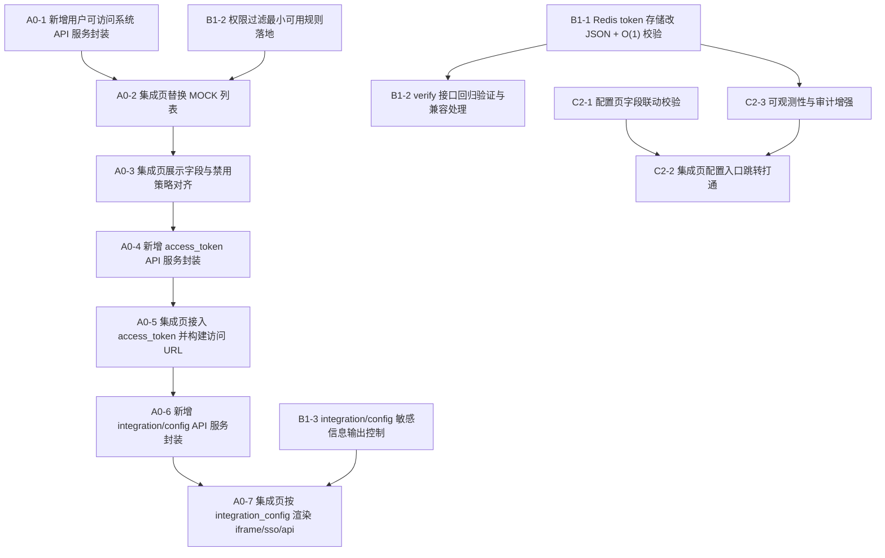

# 外部系统配置与集成现状梳理

更新时间：2026-01-09

## 1. 目标与范围

本文件用于梳理当前项目中两块能力的“现状”：

- 外部系统配置：管理员在后台维护外部系统条目（类型、URL、密钥、配置等），并通过接口增删改查。
- 外部系统集成：普通用户在“外部系统集成”页面查看可用系统并访问（iframe 内嵌、页面跳转、API 集成/SSO 等）。

不包含未来设计与完整改造方案，仅总结已实现的结构、数据流与已知缺口。

## 2. 关键入口（前端）

### 2.1 外部系统集成页面（用户侧）

- 页面文件：[ExternalSystems.tsx](file:///root/aioffer/frontend/src/pages/ExternalSystems.tsx)
- 主要职责：
  - 展示外部系统入口卡片（系统名称、类型、状态、描述等）
  - 点击“访问”后，根据系统类型决定打开方式
- 当前实现状态：
  - 系统列表使用 `MOCK_SYSTEMS`（模拟数据），没有接入后端真实接口
  - 获取访问令牌同样是模拟数据（`mock_access_token_*`）
  - iframe 打开时仅 `src={selectedSystem.page_url}`，即使代码构建了 `iframeUrl` 也未实际使用（目前 token 并没有拼进 iframe URL）
  - “配置”按钮提示“开发中”，不会跳转到配置页

### 2.2 外部系统配置页面（管理侧）

- 页面文件：[ExternalSystemsConfig.tsx](file:///root/aioffer/frontend/src/pages/settings/ExternalSystemsConfig.tsx)
- 主要职责：
  - 列表：分页、搜索、展示字段（name、system_type、page_url、endpoint_url、is_active 等）
  - 新建/编辑：表单提交，支持 config JSON 文本编辑
  - 删除：Popconfirm + 删除接口
- 依赖的前端服务：
  - [services/externalSystems.ts](file:///root/aioffer/frontend/src/services/externalSystems.ts)
  - 请求路径均为相对 `/external-systems`，由 [request.ts](file:///root/aioffer/frontend/src/utils/request.ts) 拼接为 `${baseURL}/api/external-systems`（或 dev 走 proxy `/api`）

### 2.3 前端路由位置

- 应用路由注册在：[App.tsx](file:///root/aioffer/frontend/src/App.tsx)
  - `/external-systems` → 外部系统集成页面
  - `/settings/external-systems` → 外部系统配置页面

## 3. 关键入口（后端）

### 3.1 路由注册

- FastAPI 主入口：[main.py](file:///root/aioffer/backend/main.py#L59-L66)
  - `prefix="/api/external-systems"` 挂载了 external_systems router

### 3.2 外部系统路由（CRUD + Access + 集成配置）

- 路由文件：[external_systems.py](file:///root/aioffer/backend/routers/external_systems.py)

已实现接口（以最终路径为准）：

- `GET /api/external-systems/`
  - 需要管理员权限（`current_user.is_admin`）
  - 支持分页 `page/size`、过滤 `system_type/is_active`、搜索 `search`（name / endpoint_url）
  - 返回 `ExternalSystemList`（items/total/page/size）
- `POST /api/external-systems/`
  - 需要管理员权限
  - 校验：`system_type` 为 `page/iframe` 时必须提供 `page_url`
  - 返回 `ExternalSystemResponse`
- `GET /api/external-systems/{system_id}`
  - 需要管理员权限
  - 返回 `ExternalSystemResponse`
- `PUT /api/external-systems/{system_id}`
  - 需要管理员权限
  - 校验：更新后若为 `page/iframe` 必须提供 `page_url`
  - 返回 `ExternalSystemResponse`
- `DELETE /api/external-systems/{system_id}`
  - 需要管理员权限
  - 返回 `{"message":"删除成功"}`
- `GET /api/external-systems/{system_id}/access`
  - 普通用户可调用（只要求登录）
  - 对启用系统生成 access_token，并写入 Redis（有效期 1 小时）
  - 返回 `ExternalSystemAccess`（system_id/user_id/access_token/expires_at）
- `POST /api/external-systems/{system_id}/access/verify`
  - 供外部系统调用验证 token（从 Redis 中扫描匹配）
  - 返回 `{valid: boolean, ...}`
- `GET /api/external-systems/{system_id}/integration/config?integration_type=iframe|sso|api`
  - 返回统一 config + 根据 integration_type 衍生的 iframe/sso 配置
- `GET /api/external-systems/user/accessible`
  - 返回当前用户可访问系统列表（目前逻辑为：所有启用系统都可访问）

## 4. 数据模型与存储

### 4.1 数据表：external_systems

- ORM 模型：[ExternalSystem](file:///root/aioffer/backend/models/external_system.py)
- 核心字段：
  - `name`：系统名称
  - `system_type`：`api|page|iframe`
  - `page_url`：页面地址（page/iframe 用）
  - `endpoint_url`：API 端点（api 用）
  - `api_key` / `api_secret`：密钥字段（目前为明文存储字段）
  - `config`：JSON 配置（用于 description、图标、iframe 参数、SSO 参数等）
  - `is_active`：启用/禁用
  - `created_at` / `updated_at`

### 4.2 Pydantic Schema

- [schemas/external_system.py](file:///root/aioffer/backend/schemas/external_system.py)
  - `ExternalSystemCreate/Update/Response/List`
  - `ExternalSystemAccess`
  - `PageIntegrationConfig`（url/width/height/allow_fullscreen/sandbox）
  - `SSOIntegrationConfig`（sso_url/callback_url/client_id/client_secret/scope）

## 5. 端到端数据流（现状）

### 5.1 配置流（管理员）

1. 管理员进入“外部系统配置”页面
2. 前端调用 `GET /api/external-systems/` 拉取列表并分页展示
3. 新建/编辑时前端提交 `POST/PUT /api/external-systems/...`，后端写入数据库

### 5.2 集成流（普通用户）

当前前端“外部系统集成页”尚未接入后端接口，因此真实链路未闭环。后端已经具备：

- 用户获取 access_token：`GET /api/external-systems/{id}/access`
- 用户获取集成配置：`GET /api/external-systems/{id}/integration/config`
- 外部系统验证 token：`POST /api/external-systems/{id}/access/verify`

但前端 [ExternalSystems.tsx](file:///root/aioffer/frontend/src/pages/ExternalSystems.tsx) 仍停留在 mock 阶段。

## 6. 已知缺口与风险点（基于现状）

### 6.1 前后端未闭环

- 用户侧集成页目前没有调用：
  - `GET /api/external-systems/user/accessible`
  - `GET /api/external-systems/{id}/access`
  - `GET /api/external-systems/{id}/integration/config`
- iframe URL 构建了 token 参数但未使用（当前 `iframe src` 仍为裸 page_url）

### 6.2 权限模型尚未落地

- `GET /user/accessible` 当前实现为“所有启用系统都返回”，未做基于角色/用户/组织的过滤
- `GET /{system_id}/access` 也未做细粒度权限控制（只校验系统启用）

### 6.3 Redis token 存储与校验方式存在隐患

- `get_system_access` 使用 `str(token_data)` 写入 Redis，而 `verify_system_access` 用 `replace("'", '"')` 再 `json.loads` 解析，格式不稳定，存在解析失败风险
- `verify_system_access` 通过 `keys("external_system:access:{system_id}:*")` 扫描匹配，数据量大时可能成为瓶颈

### 6.4 敏感信息存储风险

- `api_key/api_secret` 在 DB 字段中是明文（至少从模型层面看未做加密/脱敏）
- `integration/config` 直接返回 `client_secret` 等字段的风险需评估（目前实现会返回）

## 7. 相关代码索引（便于跳转）

- 前端
  - 集成页：[ExternalSystems.tsx](file:///root/aioffer/frontend/src/pages/ExternalSystems.tsx)
  - 配置页：[ExternalSystemsConfig.tsx](file:///root/aioffer/frontend/src/pages/settings/ExternalSystemsConfig.tsx)
  - API 服务：[externalSystems.ts](file:///root/aioffer/frontend/src/services/externalSystems.ts)
  - 请求封装：[request.ts](file:///root/aioffer/frontend/src/utils/request.ts)
- 后端
  - 路由：[external_systems.py](file:///root/aioffer/backend/routers/external_systems.py)
  - 模型：[external_system.py](file:///root/aioffer/backend/models/external_system.py)
  - Schema：[external_system.py](file:///root/aioffer/backend/schemas/external_system.py)

## 8. 改造任务列表（对齐版）

本节将“已知缺口与风险点”对齐为可执行的改造任务列表，按 P0/P1/P2 分层推进。每个任务包含：目标、范围、验收标准。

### 8.1 P0（必须先做：打通主链路）

#### T0-1 接入用户侧外部系统列表（替换 MOCK）

- 目标：用户侧“外部系统集成”页从后端获取真实可访问系统列表。
- 范围：
  - 前端 ExternalSystems.tsx 替换 MOCK_SYSTEMS
  - 接入 `GET /api/external-systems/user/accessible`
  - 显示字段对齐后端返回（name/system_type/page_url/description/icon/is_active）
- 验收标准：
  - 数据库新增/编辑系统后，用户侧页面可实时看到变化（刷新后）
  - 禁用系统不展示或展示为不可访问（策略需统一）

#### T0-2 接入访问令牌获取与 iframe 打开（闭环）

- 目标：用户点击“访问”时走真实 access_token，并正确传递到 iframe/页面跳转。
- 范围：
  - 前端接入 `GET /api/external-systems/{system_id}/access`
  - 对 `system_type=iframe/page`：
    - 使用后端的 `page_url`
    - 将 token/user_id 等按约定拼入 URL（或改为 header/POSTMessage，需统一方案）
  - 对 `system_type=api`：
    - 至少展示系统 endpoint_url 与“已拿到 token”的状态（避免“无响应”）
- 验收标准：
  - 点击“访问”会触发后端 access 接口日志，并拿到 token
  - iframe 打开使用的 URL 包含预期参数，或采用约定的安全传递方式

#### T0-3 接入集成配置接口（统一渲染配置）

- 目标：用户侧集成页可基于后端 integration config 渲染 iframe/sso/api 的配置细节。
- 范围：
  - 前端接入 `GET /api/external-systems/{system_id}/integration/config?integration_type=...`
  - iframe：使用后端返回的 width/height/sandbox/allow_fullscreen 等配置
  - sso：展示必要字段并预留跳转/回调入口（不做完整 SSO 也要可观测）
- 验收标准：
  - 修改 external_system.config 中 iframe 参数，前端渲染可体现（刷新后）

### 8.2 P1（安全与稳定：修隐患、补权限）

#### T1-1 修复 Redis token 存储格式与校验性能

- 目标：避免 `str(dict)` + replace 解析不稳定，并减少 keys 扫描。
- 范围（推荐方向）：
  - Redis value 使用 JSON（`json.dumps`）存储
  - key 设计调整为可直接定位：
    - 例如 `external_system:access:{system_id}:{access_token}` → value 存 user_id/expires_at
  - verify 接口改为 O(1) 读取校验（不再 keys 扫描）
- 验收标准：
  - verify 接口不再调用 `keys(...)`
  - token_data 解析不依赖 replace，且能稳定兼容

#### T1-2 落地用户可访问范围（权限过滤）

- 目标：`/user/accessible` 与 `/access` 不再默认“所有启用系统都可访问”。
- 范围（先最小可用）：
  - 引入“系统可见范围”规则（例如：按角色 role、按用户白名单、或按组织）
  - `/user/accessible` 仅返回用户有权限的系统
  - `/access` 在生成 token 前做权限校验
- 验收标准：
  - 非授权用户无法获取 access_token（403/404）
  - 列表接口对不同用户返回不同系统集合（可用两个账号验证）

#### T1-3 敏感信息保护（存储与输出）

- 目标：避免 api_secret / client_secret 明文存储与下发造成泄露。
- 范围（分两步）：
  - 输出层：`integration/config` 默认不返回 secret 字段；仅在管理员且明确场景下可获取
  - 存储层：对 `api_secret` / `client_secret` 做加密存储或拆分到专用密钥管理（最小先做加密/脱敏）
- 验收标准：
  - 普通用户调用 integration/config 不包含 secret
  - 配置页编辑时不会回显明文 secret（用占位/重置式更新）

### 8.3 P2（体验与可运维：增强管理能力）

#### T2-1 配置页表单与字段联动校验

- 目标：减少错误配置，提升可用性。
- 范围：
  - system_type=iframe/page 时必填 page_url
  - system_type=api 时必填 endpoint_url（如业务需要）
  - config JSON 校验与格式化预览（已部分具备，可优化）
- 验收标准：
  - 不满足类型要求时前端禁止提交并给出明确提示

#### T2-2 集成页“配置入口”与跳转打通

- 目标：用户侧“配置”按钮不再是“开发中”提示（至少对管理员）。
- 范围：
  - 若当前用户是管理员：跳转 `/settings/external-systems` 或打开对应编辑弹窗
  - 非管理员：隐藏该入口或只展示详情
- 验收标准：
  - 管理员从集成页可快速跳转到配置管理

#### T2-3 可观测性与审计（访问日志/失败原因）

- 目标：能快速定位“访问失败/iframe 加载失败/验证失败”等问题。
- 范围：
  - access 与 verify 记录必要审计字段（system_id/user_id/结果/耗时）
  - 前端对访问失败给出明确提示（包含后端返回 message）
- 验收标准：
  - 出现失败时：前端有提示、后端日志可定位到原因

### 8.4 建议交付顺序（依赖关系）

1. T0-1 → T0-2 → T0-3（先打通用户侧集成主链路）
2. T1-1（稳定性）与 T1-2（权限）并行推进（优先完成 T1-1）
3. T1-3（安全）在上线前完成（至少输出层不返 secret）
4. T2-* 做体验与运维增强

## 9. 原子化任务清单（可直接进入实施）

本节把第 8 节任务进一步拆到“单次可交付、可独立验证”的粒度，并明确依赖关系，便于逐个落地。

### 9.1 任务依赖图

### 9.2 P0：打通用户侧集成主链路（原子任务）

#### A0-1 新增用户可访问系统 API 服务封装

- 输入契约：
  - 后端接口：`GET /api/external-systems/user/accessible`
  - 返回结构：`{ systems: Array<{ id,name,system_type,page_url,description,icon,is_page_system,is_api_system }> }`
- 输出契约：
  - 前端新增/扩展 service 方法（建议放在 [externalSystems.ts](file:///root/aioffer/frontend/src/services/externalSystems.ts)）
  - 类型定义与响应解析完成
- 验收标准：
  - 在前端任意页面调用该方法能拿到 `systems` 数组（网络请求可见）

#### A0-2 集成页替换 MOCK 列表

- 输入契约：
  - A0-1 已完成
- 输出契约：
  - [ExternalSystems.tsx](file:///root/aioffer/frontend/src/pages/ExternalSystems.tsx) 不再使用 `MOCK_SYSTEMS`
  - 页面加载时请求真实可访问系统列表并渲染
- 验收标准：
  - 后端日志出现 `GET /api/external-systems/user/accessible` 访问记录
  - 页面显示系统卡片与后端返回一致

#### A0-3 集成页展示字段与禁用策略对齐

- 输入契约：
  - A0-2 已完成
- 输出契约：
  - 前端对 `is_active` 的处理策略明确并实现（例如：不展示禁用系统 / 展示但按钮禁用）
  - description/icon 字段与 UI 对齐（后端 icon 为字符串时需转换策略）
- 验收标准：
  - 禁用系统在 UI 的呈现符合策略且无歧义

#### A0-4 新增 access_token API 服务封装

- 输入契约：
  - 后端接口：`GET /api/external-systems/{system_id}/access`
  - 返回结构：`{ system_id,user_id,access_token,expires_at }`
- 输出契约：
  - 前端新增/扩展 service 方法（建议放在 [externalSystems.ts](file:///root/aioffer/frontend/src/services/externalSystems.ts)）
- 验收标准：
  - 调用后端接口成功返回 access_token，且能正确显示/用于后续拼接

#### A0-5 集成页接入 access_token 并构建访问 URL

- 输入契约：
  - A0-4 已完成
- 输出契约：
  - `system_type=iframe/page`：构建最终访问 URL（至少包含 access_token/user_id）
  - iframe 实际 `src` 使用“最终访问 URL”（修复当前“构建了但没用”的问题）
  - `system_type=api`：至少在 UI 上给出“已获取 token/endpoint”的可见反馈
- 验收标准：
  - 点击“访问”必定触发 `/access` 请求
  - iframe `src` 与预期一致，页面不再“无反应”

#### A0-6 新增 integration/config API 服务封装

- 输入契约：
  - 后端接口：`GET /api/external-systems/{system_id}/integration/config?integration_type=iframe|sso|api`
- 输出契约：
  - 前端新增/扩展 service 方法（建议放在 [externalSystems.ts](file:///root/aioffer/frontend/src/services/externalSystems.ts)）
  - 类型定义覆盖 `iframe_config` / `sso_config`
- 验收标准：
  - 能按 integration_type 获取并解析对应配置字段

#### A0-7 集成页按 integration_config 渲染 iframe/sso/api

- 输入契约：
  - A0-6 已完成
- 输出契约：
  - iframe：宽高、sandbox、allowFullscreen 等由后端 config 驱动
  - sso/api：展示关键字段，并提供明确的下一步动作入口（按钮/链接）
- 验收标准：
  - 调整 external_system.config（width/height 等）后，前端渲染可见变化

### 9.3 P1：稳定性/安全（原子任务）

#### B1-1 Redis token 存储改为 JSON + O(1) 校验

- 输入契约：
  - 后端：[external_systems.py](file:///root/aioffer/backend/routers/external_systems.py) 当前实现依赖 `keys(...)` + 解析 `str(dict)`
- 输出契约：
  - `get_system_access`：value 使用 `json.dumps`，key 可直接按 token 读取
  - `verify_system_access`：不再扫描 keys，改为单次 get 校验
- 验收标准：
  - verify 接口不再使用 `keys(...)`
  - 任意 token 校验稳定通过/失败且结果可解释

#### B1-2 verify 接口回归验证与兼容处理

- 输入契约：
  - B1-1 已完成
- 输出契约：
  - 对旧 key/value（历史数据）处理策略明确（例如：不兼容直接失效 / 兼容读取一次并迁移）
- 验收标准：
  - 兼容策略符合预期且不会导致 500

#### B1-3 权限过滤最小可用规则落地

- 输入契约：
  - 需要明确“系统可见范围”的最小规则（优先：按角色/白名单二选一）
- 输出契约：
  - `/user/accessible` 与 `/access` 都进行权限校验
- 验收标准：
  - 不同用户获取到的系统列表不同，且越权请求返回 403/404

#### B1-4 integration/config 敏感信息输出控制

- 输入契约：
  - 当前 `/integration/config` 可能返回 client_secret 等敏感字段
- 输出契约：
  - 普通用户默认不返回 secret；管理员视场景返回（或也不返回，改为单独接口）
- 验收标准：
  - 普通用户调用不包含 secret 字段，前端仍能正常渲染

### 9.4 P2：体验/可运维（原子任务）

#### C2-1 配置页字段联动校验

- 输入契约：
  - 配置页：[ExternalSystemsConfig.tsx](file:///root/aioffer/frontend/src/pages/settings/ExternalSystemsConfig.tsx)
- 输出契约：
  - system_type=iframe/page：强制 page_url
  - system_type=api：按需要强制 endpoint_url
- 验收标准：
  - 不满足条件无法提交，提示明确

#### C2-2 集成页配置入口跳转打通

- 输入契约：
  - 用户侧集成页存在“配置”按钮但目前仅提示“开发中”
- 输出契约：
  - 管理员点击跳转到 `/settings/external-systems`（或打开编辑弹窗）
  - 非管理员隐藏或降级为“查看详情”
- 验收标准：
  - 管理员从集成页可一键进入配置管理

#### C2-3 可观测性与审计增强

- 输入契约：
  - access/verify 关键路径需要更易排查
- 输出契约：
  - 后端：access/verify 增强日志字段（system_id/user_id/结果/耗时）
  - 前端：错误提示展示后端 message/detail（避免“无反应”）
- 验收标准：
  - 任意失败场景可通过“前端提示 + 后端日志”定位原因
