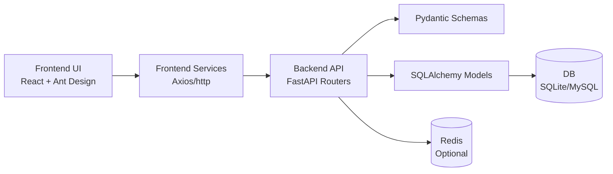

# DESIGN_项目梳理

创建日期：2026-01-09  
用途说明：输出项目的系统分层、模块依赖、接口契约与异常策略（概要级）。

## 1. 架构分层（概要）

- Presentation：React 页面（pages）+ Ant Design 组件
- Client Service：前端 services（axios 封装）
- API：FastAPI routers（REST）
- Domain/Data：SQLAlchemy models + Pydantic schemas
- Infra：DB（SQLite/MySQL）、Redis（可选）、日志与响应工具

## 2. 组件关系图（Mermaid）

## 3. 关键接口契约（示例级）

- Auth
  - POST `/api/auth/login`：登录，返回 JWT
- Users
  - GET `/api/users`：分页列表
  - POST `/api/users`：创建用户
- Roles
  - GET `/api/roles`：分页列表
  - GET `/api/roles/{id}`：详情（含权限列表）
  - GET `/api/roles/permissions/all`：全量权限
  - POST `/api/roles/{id}/permissions`：覆盖式分配权限
- Menus
  - GET `/api/menus/user`：按当前用户权限返回菜单树

## 4. 异常处理策略（现状 + 建议）

- 后端统一响应：`utils.response` 返回结构化 code/message/data
- 全局异常：`main.py` 的 exception handler 捕获未处理异常返回 500
- 前端统一请求：`utils/request` 统一处理错误提示（Ant Design message）

