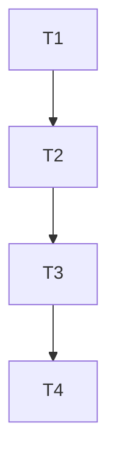

# TASK_项目梳理

创建日期：2026-01-09  
用途说明：把“项目梳理”拆成可执行的原子任务，并明确依赖与验收。

## 1. 原子任务清单

### T1：梳理技术栈与模块边界
- 输入契约：可读取 README、requirements、package.json、路由注册与页面结构
- 输出契约：形成 `说明文档.md` 的“技术栈现状/目录结构/模块范围”内容
- 验收标准：文档内容可定位到具体目录/文件

### T2：落地说明文档（规划/方案/进度）
- 输入契约：T1 输出
- 输出契约：根目录 `说明文档.md`
- 验收标准：三大模块齐全，里程碑可执行，进度含证据与后续

### T3：生成 6A 文档集
- 输入契约：T1、T2 输出
- 输出契约：`docs/项目梳理/` 下 ALIGNMENT/CONSENSUS/DESIGN/TASK/ACCEPTANCE/FINAL/TODO
- 验收标准：文件齐全且内容与范围一致

### T4：执行自检并回填验收
- 输入契约：后端/前端可在当前环境执行检查命令（不安装新依赖）
- 输出契约：ACCEPTANCE 与 说明文档进度更新
- 验收标准：记录检查命令与结果（成功或失败原因）

## 2. 任务依赖图（Mermaid）

